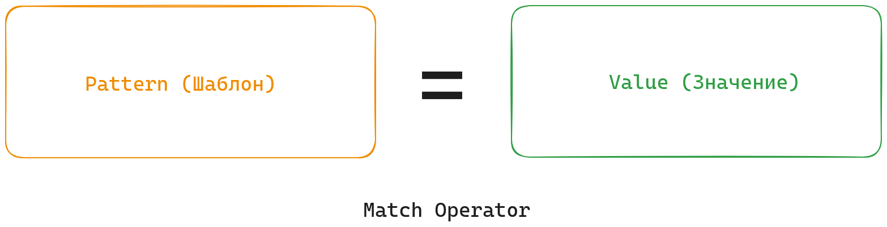

# Сопоставление с образцом (Pattern Matching)

Одна из главных особенностей функционального программирования -- сопоставление с образцом. Применяется очень широко, так что вряд ли можно найти такую программу на функциональном языке, где нет pattern matching.

```elixir-iex
iex(1)> a = 123
123
iex(2)> a
123
```

Эта элементарная конструкция, которая выглядит, как присваивание значения переменной, на самом деле не является присваиванием. Присваивания в Эликсире нет, а оператор `=` называеся оператором сопоставления (match operator).

В данном коде значение справа -- `123` -- сопоставляется с шаблоном слева -- переменной `a`. И поскольку шаблон соответствует значению, то сопоставление происходит успешно, и переменная `а` связывается со значением.



Однако, это тривиальный случай. Чтобы понять PM нужно рассмотреть более сложные случаи.

Совпадение по значению:
```
iex(1)> 42 = 42 # ok
iex(2)> 20 = 42 # MatchError
```

Совпадение нескольких значений:
```
iex(3)> {:ok, 42, 100} = {:ok, 42, 100} # ok
iex(4)> {:ok, 42, 100} = {:ok, 42, 200} # MatchError
```

Использование переменных в шаблоне:
```
iex(5)> {:ok, a, b} = {:ok, 42, 100} # ok
iex(6)> a
42
iex(7)> b
100
```

Совпадение по структуре:
```

iex(6)> {:ok, a, b} = {:ok, 42, 100, 500} # MatchError
iex(6)> {:ok, a, b} = {:ok, 42, {100, 500}}
{:ok, 42, {100, 500}}
iex(7)> b
{100, 500}
iex(8)> {:ok, a, {b, c}} = {:ok, 42, {100, 500}}
{:ok, 42, {100, 500}}
iex(9)> b
100
iex(10)> c
500
```

## Сопоставление с образцом используется для:

- присвоения значений переменным;
- извлечения значений из сложных структур данных;
- условных переходов.

Рассмотрим все эти случаи на примерах.


### Присвоение значений переменным

```elixir-iex
iex(3)> user = {:user, "Bob", 25}
{:user, "Bob", 25}
```

Это самый тривиальный случай, когда всё значение справа целиком присваивается в переменную слева.


### Извлечение значений из сложных структур данных

```elixir-iex
iex(3)> user = {:user, "Bob", 25}
{:user, "Bob", 25}
iex(4)> {:user, name, age} = user
{:user, "Bob", 25}
iex(5)> name
"Bob"
iex(6)> age
25
```

Тут уже интереснее. Слева у нас шаблон, который может совпасть только с кортежами из трех элементов, где первым элементом должен быть атом `:user`, а второй и третий элемент могут быть любыми.

Справа значение, которое мы сравниваем с шаблоном. В данном случае значение задано литералом, но оно может быть переменной или результатом вызова функции.

Сопоставление проходит успешно, и в результате переменные шаблона `name` и `age` получают значения `"Bob"` и `25`.

И значение, и шаблон могут быть сложными структурами с любой глубиной вложенности.

В качестве упражнения создадим большую и глубокую структуру:

```elixir
iex(23)> user1 = {:user, "Bob", :developer, {:skills, ["Elixir", "Erlang"]}}
{:user, "Bob", :developer, {:skills, ["Elixir", "Erlang"]}}
iex(24)> user2 = {:user, "Bill", :developer, {:skills, ["Ruby", "Elixir"]}}
{:user, "Bill", :developer, {:skills, ["Ruby", "Elixir"]}}
iex(25)> user3 = {:user, "Kate", :teamlead, {:skills, ["Hiring", "Planing", "Elixir"]}}
{:user, "Kate", :teamlead, {:skills, ["Hiring", "Planing", "Elixir"]}}
iex(26)> team = {:team, "Cool Team", {:members, [user1, user2, user3]}}
{:team, "Cool Team",
 {:members,
  [
    {:user, "Bob", :developer, {:skills, ["Elixir", "Erlang"]}},
    {:user, "Bill", :developer, {:skills, ["Ruby", "Elixir"]}},
    {:user, "Kate", :teamlead, {:skills, ["Hiring", "Planing", "Elixir"]}}
  ]}}
```

Здесь у нас кортеж из 3-х элементов представляет команду разработчиков. Третий элемент -- это кортеж со списком членов команды. Каждый элемент списка, это опять кортеж, внутри которого есть ещё кортеж и список. Всего тут 6 уровней вложенности.

Попробуем разные шаблоны:
```
[{:user, _, _, _}, {:user, name, _, {:lang, [lang1, lang2]}}, _] = users
[
  {:user, "Bob", :developer, {:lang, ["Erlang", "Elixir"]}},
  {:user, "Bill", :developer, {:lang, ["Python", "JavaScript"]}}
]
```

Извлечём название команды:
```
iex(29)> {:team, team_name, _} = team
iex(30)> team_name
"Cool Team"
```

Обратите внимания на символ подчеркивания. Это универсальный шаблон, который совпадает с любым значением. Он применяется, когда нам не нужно значение на данной позиции.

Извлечём данные первого члена команды:
```
iex(31)> {:team, _, {:members, [first_member | _]}} = team
iex(32)> first_member
{:user, "Bob", :developer, {:skills, ["Elixir", "Erlang"]}}
```

Извлечём имя второго члена команды:
```
iex(33)> {:team, _, {:members, [_, {:user, name, _, _}, _]}} = team
iex(34)> name
"Bill"
```

Извлечём роль и навыки третьего члена команды:
```
iex(35)> {:team, _, {:members, [_, _, {:user, _, role, skills}]}} = team
iex(36)> role
:teamlead
iex(37)> skills
{:skills, ["Hiring", "Planing", "Elixir"]}
```


### Условные переходы

Сопоставление с образцом также используется для ветвлений в коде (условных переходов):
- конструкция case
- клозы функций (function clause)
- обработка исключений (resque, catch)
- чтение сообщений из mailbox (receive)

Конструкции case и function clause рассмотрим в следущей теме. Обработка исключений и чтение сообщений будут позже в курсе.


## Как устроен Pattern Matching

Теперь формализуем то, что мы узнали. Итак, у нас есть оператор сопоставления `=`, слева от него -- шаблон, и справа -- значение.

```
pattern = value
```

Шаблон может включать:
- литералы
- переменные
- универсальный шаблон (символ подчеркивания)

Значение может включать:
- литералы
- переменные
- выражения

Литералы в шаблоне слева должны совпасть с литералами, переменными и результатами вычисления значений справа. Все в целом должно совпасть по структуре. Тогда переменные в шаблоне слева получают свои значения из соответствующих позиций справа. Универсальный шаблон совпадает с чем угодно.


## Ещё некоторые нюансы

Если переменная встречается два раза, то значения в этих местах должны быть одинаковыми:

```elixir-iex
iex(20)> {a, a, 42} = {10, 10, 42}
{10, 10, 42}
iex(21)> {a, a, 42} = {20, 20, 42}
{20, 20, 42}
iex(22)> {a, a, 42} = {10, 20, 42}
** (MatchError) no match of right hand side value: {10, 20, 42}
```

Но это не касается символа подчеркивания:

```elixir-iex
iex(22)> {_, _, 42} = {10, 10, 42}
{10, 10, 42}
iex(23)> {_, _, 42} = {20, 20, 42}
{20, 20, 42}
iex(24)> {_, _, 42} = {10, 20, 42}
{10, 20, 42}
```


## pin operator

Переменная в шаблоне может выполнять две роли. Либо мы хотим, чтобы эта переменная получила новое значение, и тогда не важно, использовалась ли эта переменная раньше, было ли у нее какое-то значение. Либо мы хотим использовать значение, которое переменная уже имеет, как часть шаблона. Во втором случае понадобится pin operator.

```elixir-iex
iex(1)> animal = :cat
:cat
iex(2)> {^animal, "Tihon"} = {:cat, "Tihon"}
{:cat, "Tihon"}
iex(3)> {^animal, "Tihon"} = {:dog, "Tihon"}
** (MatchError) no match of right hand side value: {:dog, "Tihon"}
```

pin operator извлекает текущее значение переменной и подставляет его в шаблон. И дальше это значение в шаблоне работает, как литерал.

