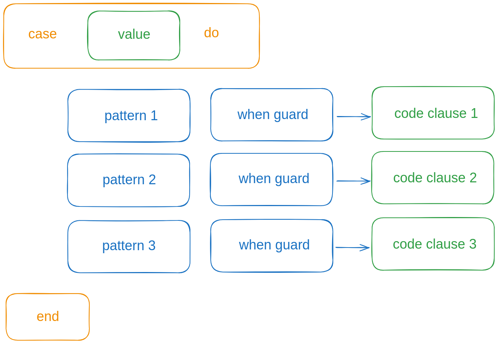
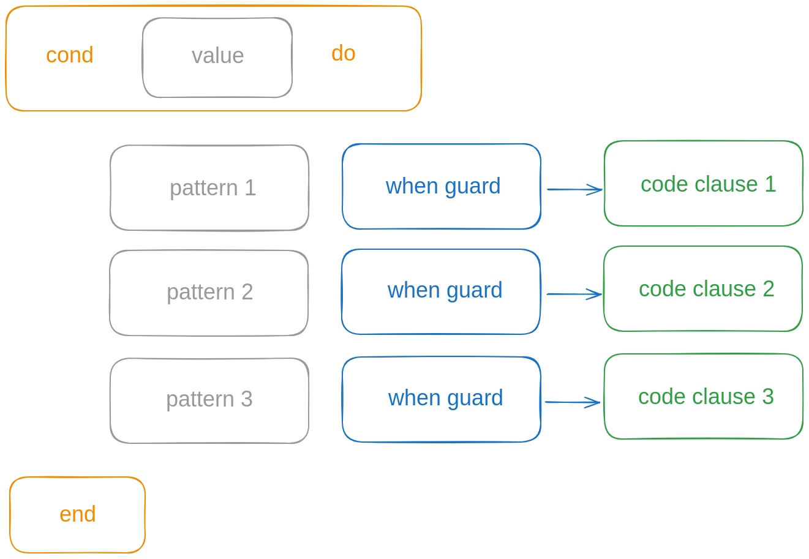

## Конструкция cond

Посмотрим ещё раз на конструкцию case:



Если из неё убрать значение и шаблоны:



Но оставить охранные выражения и ветки кода, то получится конструкция cond:


Можно считать, что `cond` -- это вырожденный случай `case`.

Мы использовали эту конструкцию в первом уроке, когда реализовывали FizzBuzz:

```elixir
  def fizzbuzz(n) do
    cond do
      rem(n, 3) == 0 and rem(n, 5) == 0 -> IO.puts("FizzBuzz")
      rem(n, 3) == 0 -> IO.puts("Fizz")
      rem(n, 5) == 0 -> IO.puts("Buzz")
      true -> IO.puts(n)
    end
  end
```

`cond` -- это эквивалент цепочки `if...else if`, которая встречается во многих языках программирования.

Вернёмся к модулю ControlFlow и добавим пример с cond:

```
  def handle11(num) do
    cond do
      num > 10 -> IO.puts("more than 10")
      num > 5 -> IO.puts("more than 5")
    end
  end
```

Посмотрим, как это работает:

```
iex(1)> alias ControlFlow, as: CF
ControlFlow
iex(2)> CF.handle11(20)
more than 10
:ok
iex(3)> CF.handle11(7)
more than 5
:ok
iex(4)> CF.handle11(1)
** (CondClauseError) no cond clause evaluated to a truthy value
    control_flow.exs:125: ControlFlow.handle11/1
    iex:4: (file)
```

Как и в `case`, если ни один из блоков не выполнился, то генерируется исключение `CondClauseError`.

И здесь тоже можно использовать catch all:

```
  def handle12(num) do
    cond do
      num > 10 -> IO.puts("more than 10")
      num > 5 -> IO.puts("more than 5")
      true -> IO.puts("less or equal to 5")
    end
  end
```

Выражение `true` всегда будет срабатывать, если не сработали выражения выше:

```
iex(2)> CF.handle12(20)
more than 10
:ok
iex(3)> CF.handle12(7)
more than 5
:ok
iex(4)> CF.handle12(3)
less or equal to 5
:ok
```

Как и в конструкции `case`, очередность выражений важна.

```
  def handle13(num) do
    cond do
      num > 5 -> IO.puts("more than 5")
      num > 10 -> IO.puts("more than 10")
      true -> IO.puts("less or equal to 5")
    end
  end
```

Здесь первое выражение перехватит всё, что могло бы сработать во втором выражении:

```
iex(6)> CF.handle13(20)
more than 5
:ok
iex(7)> CF.handle13(7)
more than 5
:ok
```

И мы не получили предупреждений от компилятора. Даже в таком простом случае компилятор не может определить, что первое выражение "шире", чем второе.


## Конструкция if

Если мы продолжим упрощать, и в конструкции `cond` оставим только одно выражение и catch all:

```
  def handle14(num) do
    cond do
      num >= 5 -> IO.puts("more or equal to 5")
      true -> IO.puts("less than 5")
    end
  end
```

То мы получим эквивалент конструкции `if`:

```
iex(9)> CF.handle14(10)
more or equal to 5
:ok
iex(10)> CF.handle14(5)
more or equal to 5
:ok
iex(11)> CF.handle14(1)
less than 5
:ok
```

И его вполне достаточно, в языке Эрланг на этом и остановились. Но в Эликсир добавили привычный всем `if`:

```
  def handle15(num) do
    if num >= 5 do
      IO.puts("more or equal to 5")
    else
      IO.puts("less than 5")
    end
  end
```

Небольшая разница в том, что `if` без блока `else` не приводит к исключению, а `cond` из одного выражения и без catch all приведёт к нему:

```
  def handle16(num) do
    cond do
      num >= 5 -> IO.puts("more or equal to 5")
    end
  end
```

```
iex(20)> CF.handle16(5)
more or equal to 5
:ok
iex(21)> CF.handle16(1)
** (CondClauseError) no cond clause evaluated to a truthy value
    control_flow.exs:168: ControlFlow.handle16/1
    iex:21: (file)
```

Важное отличие от императивных языков в том, что `if` всегда возвращает какое-то значение. Как и остальные конструкции: `case`, `cond`:

```
  def handle17(num) do
    if num >= 5 do
      :more_or_equal_to_5
    else
      :less_than_5
    end
  end
```

```
iex(22)> result = CF.handle17(10)
:more_or_equal_to_5
iex(23)> result
:more_or_equal_to_5
iex(24)> result = CF.handle17(3)
:less_than_5
iex(25)> result
:less_than_5
```

Некоторые функциональные языки требуют, чтобы часть `else` всегда присутствовала, потому что значение нужно вернуть в любом случае, выполняется условие `if` или не выполняется. А, например, в Rust значения в обоих блоках ещё должны быть одинакового типа.

Эликсир этого не требует:

```elixir
  def handle18(num) do
    if num >= 5 do
      :more_or_equal_to_5
    end
  end
```

```
iex(28)> result = CF.handle18(5)
:more_or_equal_to_5
iex(29)> result = CF.handle18(1)
nil
iex(30)> result
nil
iex
```

Как видим, в этом случае возвращается `nil`.
