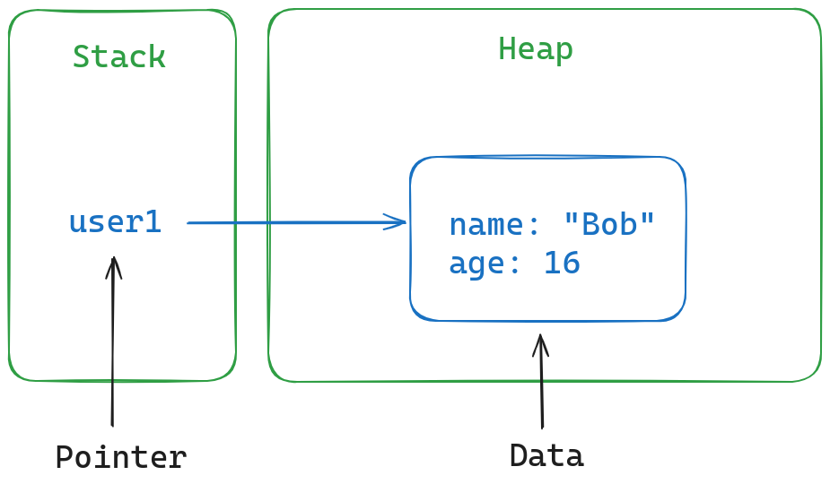
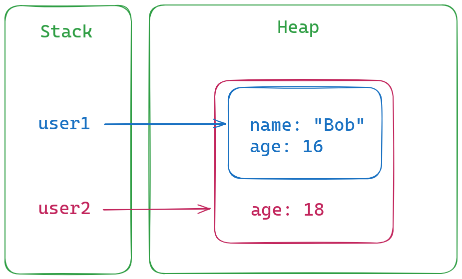

# Иммутабельность

Эликсир, как и большинство других функциональных языков, основан на иммутабельности данных.

Польза иммутабельности:
- исключает ошибки, связанные с модификацией одной области памяти из разных мест в коде;
- в т.ч. из разных потоков, что существенно упрощает многопоточное программирование;
- упрощает сборку мусора (связи между данными представлены ацикличным графом);
- сохраняются все промежуточные версии данных, что упрощает отладку;
- компилятор имеет больше возможностей для оптимизации кода;
- статический анализатор имеет больше возможностей для проверки корректности кода.

Плата за это -- несколько менее эффективные структуры данных, чем в императивных языках. Можно говорить, что в среднем производительность мутабельных и иммутабельных структур данных сопоставима, но в крайних случаях производительность хуже.

К счастью, под капотом в VM многие операции реализованы на мутабельных данных.


## Как это работает

У нас есть некие данные, сохранённые в динамически выделенной памяти (в куче). И у нас есть именованая переменная, сохранённая на стеке, которая указывает на эти данные.



Мутабельными/иммутабельными могут быть и данные в куче, и указатель на стеке. Что даёт 4 комбинации:
- мутабельные данные, мутабельный указатель -- большинство императивных языков;
- иммутабельные данные, мутабельный указатель (переменная) -- Эликсир;
- иммутабельные данные, иммутабельный указатель (константа) -- Эрланг;
- мутабельная память, иммутабельный указатель -- не имеет смысла на практике.

Эликсир гарантирует, что выделенная память не модифицируется. Но значение переменной, которая указывает на эту область памяти, можно изменить. То есть, указать на другую область памяти. В Эрланг и этого делать нельзя, не только данные, но и переменные остаются неизменяемыми.

Для примера рассмотрим код:

```elixir-iex
iex(1)> my_list = [1, 2, 3]
[1, 2, 3]
iex(2)> my_list = my_list ++ [4, 5]
[1, 2, 3, 4, 5, 4, 5]
iex(3)> my_list = my_list ++ [6, 7, 8]
[1, 2, 3, 4, 5, 4, 5, 6, 7, 8]
```

Здесь мы имеем 3 списка, каждый из них размещен в своей области памяти. И здесь есть одна переменная, которая сперва указывает на первый список, затем на второй, затем на третий.

Данные не меняются, и мы можем увидеть все версии списка:

```
iex(4)> v(1)
[1, 2, 3]
iex(5)> v(2)
[1, 2, 3, 4, 5]
iex(6)> v(3)
[1, 2, 3, 4, 5, 6, 7, 8]
```

Аналогичный код на Эрланг будет выглядеть так:

```elixir
1> MyList = [1, 2, 3].
[1,2,3]
2> MyList2 = MyList ++ [4, 5].
[1,2,3,4,5]
3> MyList3 = MyList2 ++ [6, 7, 8].
[1,2,3,4,5,6,7,8]
```

Здесь тоже 3 списка и 3 разные переменные, которые указывают каждая на свой список.

```
4> MyList.
[1,2,3]
5> MyList2.
[1,2,3,4,5]
6> MyList3.
[1,2,3,4,5,6,7,8]
```


## Переиспользование памяти (Structure Sharing)

Итак, данные, записаные в некую область памяти, не меняются. Тем не менее, нам нужно как-то выразить идею о том, что состояние некой нашей сущности меняется.

Эти изменения можно сохранить в другой области памяти. Обычно меняется не вся сущность целиком, а какая-то её часть.

Например, человек взрослеет, и у него меняется возраст:
```
iex(9)> user = %{name: "Bob", age: 16}
%{name: "Bob", age: 16}
iex(10)> user = %{user | age: 18}
%{name: "Bob", age: 18}
```

Если мы будем при каждом изменении копировать все данные в новую область памяти, то это будет очень неэффективно. Поэтому новая память выделяется только под изменённые данные, и остаётся ссылка на старую версию данных. Таким образом, неизменившаяся часть данных переиспользуется в обоих версиях. Это называется переиспользование памяти или Structure Sharing.



Получается, что часть данных одновременно принадлежит нескольким версиям сущности. Или даже нескольким разным сущностям.
