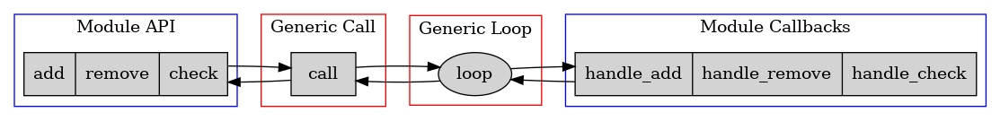
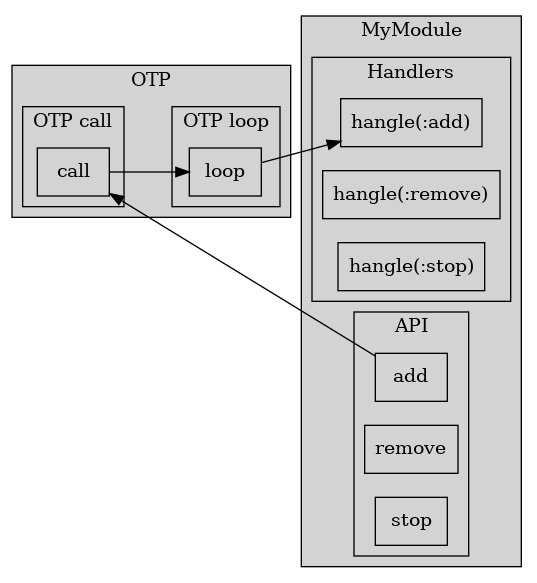

# GenServer

Давайте еще раз посмотрим на сервер, который мы написали.



У нас есть публичный АПИ модуля, абстрактный (generic) call, абстрактный loop и обработчики запросов.

АПИ и call работают в потоке клиента, loop и обработчики работают в потоке сервера.

АПИ и обработчики реализуют специфичное поведение сервера, а call и loop являются одинаковыми для любых серверов. Поэтому их лучше вынести из модуля в отдельную библиотеку, чтобы переиспользовать в других модулях. 

Стандартный GenServer устроен точно так же:



Те же 4 части (АПИ, call, loop и обработчики) я расположил квадратом.

Два верхних блока (АПИ и call) работают в потоке клиента. Два нижних блока (обработчики и loop) работают в потоке сервера.

Два левых блока (АПИ и обработчики) -- это специфичный код нашего модуля. Два правых блока (call и loop) реализованы внутри фреймворка OTP.


## Сервер PathFinder

### Описание задачи

Возьмем задачу немного сложнее, чем добавление и удаление элементов в списке. Реализуем сервер, который хранит граф с информацией о городах и расстояниях между ними. АПИ сервера позволяет указать два города, и получить путь в графе и расстояние между ними. 

Изначально данные хранятся в [csv-файле](./data/cities.csv):
```
Архангельск,Брянск,1598
Архангельск,Воронеж,1723
Архангельск,Казань,2033
Архангельск,Москва,1234
...
```

На старте сервер загружает этот файл и строит по нему граф:


Затем сервер принимает запросы:
```
PathFinder.get_route("Санкт-Петербург", "Самара")
```
и отвечает на них:
```
{["Санкт-Петербург", "Брянск", "Волгоград", "Самара"], 3764}
```

### Работа с графом

Для работы с графом мы возьмем эрланговский модуль [:digraph](https://erlang.org/doc/man/digraph.html). Он входит в стандартную библиотеку, так что нам не придется подключать зависимости. Модуль реализует ориентированный граф (directed graph), а для нашей задачи нужен неориентированный (undirected). Увы, реализации неориентированного графа нет в стандартной библиотеке. 

(В Эликсир есть библиотека [libgraph](https://github.com/bitwalker/libgraph), которая дает более мощное АПИ для работы с графами, и более эффективную реализацию).

Работа с :digraph выглядит так:
```
iex(1)> graph = :digraph.new()
iex(2)> :digraph.add_vertex(graph, :a)
iex(3)> :digraph.add_vertex(graph, :b)
iex(4)> :digraph.add_vertex(graph, :c)
iex(5)> :digraph.add_edge(graph, :a, :b)
iex(6)> :digraph.add_edge(graph, :b, :c)
iex(7)> :digraph.get_short_path(graph, :a, :c)
[:a, :b, :c]
iex(8)> :digraph.get_short_path(graph, :c, :a)
false
```

Важный нюанс -- это АПИ сделано не в функциональном стиле. Функции *add_vertex* и *add_adge* не возвращают новый граф, а мутируют существующий. Дело в том, что граф трудно реализовать в иммутабельных структурах данных. Такая реализация хотя и возможна, но не эффективна. В BEAM есть возможность работать с мутабельными данными -- это ETS-таблицы, которые мы будем изучать позже в нашем курсе.

Второй важный нюанс -- для каждой пары городов мы будем добавлять два ребра в обоих направлениях, и таким образом реализуем неориентированный граф поверх ориентированного. Что тоже не очень эффективно, но для учебной задачи подойдет.


### Инициализация сервера

Для запуска сервера мы вызваем:
```
GenServer.start(ModuleName, initial_arguments, server_options)
```
В нашем случае это:
```
GenServer.start(PathFinder, :no_args, [name: PathFinder])
```

GenServer.start принимает имя модуля, в котором должно быть реализовано специфичное для сервера поведение -- публичное АПИ, инициализация состояния и обработчики запросов.

Вторым аргументом он принимает некие данные, которые понадобятся серверу при инициализации. В нашем случае никакие данные не нужны, так что я передаю атом `:no_args`. (В этой ситуации часто передают пустой список).

Третий аргумент -- стандартные настройки, определяющие поведение сервера. Мы передаем настройку `name`, благодаря чему сервер регистрируется по указанному имени. И с ним можно взаимодействовать по имени, а не по pid.

GenServer -- это модуль стандартной библиотеки, который реализует ту самую generic часть (call и loop), которую мы видели в своей кастомной реализации. На самом деле он реализует намного больше, чем просто call и loop. 

(Эликсировский модуль GenServer является оберткой над эрланговским модулем :gen_server. В сравнении с эрлангом он добавляет некоторые удобства. Например, автоматически генерирует код всех обработчиков. В эрланге этот код нужно писать вручную.)

При вызове `GenServer.start` запускается новый процесс, и в нем выполянется функция `PathFinder.init`. Это один из 6-ти обработчиков, которые нужно определять в своем модуле. Функция init принимает initial_arguments и формирует состояние процесса. 

Вызов GenServer.call блокируется, пока не завершится init. После этого процесс входит в loop с нужны состоянием, и готов обрабатывать запросы.


### Обработка запроса

TODO
- обработка запроса: get_route - handle_call.


### Демонстрация работы

```
iex(1)> c "lib/path_finder.exs"
[PathFinder]
iex(6)> PathFinder.start()
{:ok, #PID<0.126.0>}

> PathFinder.get_route("Санкт-Петербург", "Тюмень")
{["Санкт-Петербург", "Брянск", "Тюмень"], 3561}

> PathFinder.get_route("Санкт-Петербург", "Самара")
{["Санкт-Петербург", "Брянск", "Волгоград", "Самара"], 3764}

> PathFinder.get_route("Москва", "Воронеж")
{["Москва", "Архангельск", "Воронеж"], 2957}

> PathFinder.get_route("Екатеринбург", "Махачкала")
{["Екатеринбург", "Астрахань", "Тюмень", "Брянск", "Махачкала"], 9408}
```

### PathFinder как GenServer

Посмотрим еще раз на реализацию PathFinder как GenServer:


## GenServer behaviour

TODO read
https://hexdocs.pm/elixir/1.12/GenServer.html

**behaviour** в эрланг -- это аналог интерфейсов в джава. Он
описывает, какие callback-функции должны быть определены, их имена и
аргументы.

**behaviour(gen_server)** требует, чтобы наш модуль определил функции
init/1, handle\_call/3, handle\_cast/2, handle\_info/2, terminate/2 и code\_change/3.

TODO описание всех callback, их аргументов и возвращаемых значений

OTP works by assuming that your module defines a number of callback functions 
(six, in the case of a GenServer). 

If you were writing a GenServer in Erlang, your code would have to contain implementations of all six.

When you add the line ‘use GenServer‘ to a module, 
Elixir creates default implementations of these six callback functions.
All we have to do is override the ones where we add our own application-specific behavior.


### init

GenServer.start works synchronously. It returns only after init/1 callback has finished in server process.
Client process is blocked until the server process is initialized.

If init/1 returns {:stop, reason} client will receive {:error, reason}.
If init/1 returns :ignore, client will receive :ignore.
The first is an error situation, the second is a normal situation.


### call

GenServer.call doesn't wait indefinitely for a responce. 5 sec timeout by default.
If server process terminates while client is waiting for resonce, GenServer detects it and raises a corresponding error in the client process. 

loop isn't CPU-intensive. Waiting for a message puts process in a suspended state and doesn't waste CPU cycles.

handle_call должен обработать сообщение, сформировать ответ для клиента и
новое состояние для сервера.

Есть несколько вариантов возвращаемого значения. Но мы не будем рассматривать
все возможные случаи. Чаще всего мы отвечаем {reply, Reply, NewState}.

Обычно каждой АПИ функции модуля соответствует отдельное сообщение, а
каждому сообщению отдельная ветка handle\_call. Если АПИ большое, то и
веток handle\_call много.

```
my_api_1(A) ->
    gen_server:call(?MODULE, {msg1, A}).
my_api_2(A, B) ->
    gen_server:call(?MODULE, {msg2, A, B}).
my_api_3(A, B, C) ->
    gen_server:call(?MODULE, {msg3, A, B, C}).
...
handle_call({msg1, A}, _From, State) ->
...
handle_call({msg2, A, B}, _From, State) ->
...
handle_call({msg3, A, B, C}, _From, State) ->
```

Поэтому внутри handle\_call много кода лучше не писать, а выносить его в отдельные функции.


### cast

Вызов gen_server:call блокирует клиента, пока сервер не обработает его запрос и не вернет ответ.
Бывают случаи, когда клиенту ответ сервера не нужен. Тогда лучше использовать gen\_server:cast.
Клиент не блокируется и не ждет ответ сервера. Но сервер получает и обрабатывает сообщение.

Для этого вызывается callback-функция handle_cast:

```
do_something(A, B) ->
    gen_server:cast(?MODULE, {do_something, A, B}),
    ok.
...
handle_cast({do_something, A, B}, State) ->
    NewState = ...
    {noreply, NewState};
```

handle_cast должен вернуть измененное состояние.


### info

Любой поток из любого места в коде может отправить серверу сообщение
оператором **!**.  Так делать не рекомендуется, потому что это вызовы
в обход API сервера.  Но иногда так делают.

Если сообщения в функции loop сервера приходят не из gen\_server:call/cast,
то они обрабатываются в callback-функции handle\_info.

```
handle_info({some_message, A, B}, State) ->
    NewState = ...
    {noreply, NewState};
```

The monitoring :DOWN messages are an example of this.

Сервер и сам может отправлять себе сообщения таким образом. Например,
для отложенной инициализации (это мы рассмотрим ниже), или для
выполнения повторяющихся операций через интервалы времени.


### terminate

Этот callback вызывается, когда gen_server останавливается.  Если
поток в процессе своей работы занимал какие-то ресурсы (соединение с
базой данных, сокеты, файлы и т.д.), то по правилам OTP предлагается
освобождать их здесь.

Или если поток накопил какие-то данные, которые нужно куда-то
сохранить, то можно делать это здесь. Хотя надежнее сохранять данные
периодически, через регулярные интервалы времени. Это минимизирует
потери в случае аварийного завершения потока. terminate тогда не
вызывается.


### code_change

Этот callback вызывается при горячем обновлении кода. Такое обновление
тесно связано с релизами, и мы не рассматриваем его в рамках курса.
Но для полноты изложения callback упомянем.

В новой версии кода возможно изменилось состояние процесса. В #state{}
могло появиться что-то новое, или что-то было убрано, или вообще
состояние стало храниться в совсем другой структуре данных.

code_change принимает на входе старый #state{}, и должен его
преобразовать и вернуть новый #state{}.

TODO это в некоторой степени похоже на миграцию БД.


## Сравнение с ООП

Вы могли заметить некоторое сходство с ООП. Есть объект с внутренним
состоянием, публичным АПИ и скрытой реализацией. Таких объектов
(потоков) на базе одного класса (модуля) можно создать много. У всех у
них будет одинаковое по структуре, но разное по содержанию
состояние. Объекты могут взаимодействовать друг с другом, обмениваясь
сообщениями.

Если серверный поток регистрируется под определенным именем, то это
"одиночка" (singleton). Он такой один, и к нему можно обращаться по
имени:

```
gen_server:call(some_name, some_message)
```

Если поток не регистрируется, то таких объектов может быть много, и нужно
обращаться к ним по Pid:

```
gen_server:call(Pid1, some_message).
gen_server:call(Pid2, some_message).
```

Похожесть есть, но есть и нюансы. Для ООП объекта вполне нормально
вызывать свои собственные методы. А с gen\_server можно попасть в
коварную ловушку :)


## Agents and Tasks, or GenServer?

When do you use agents and tasks, and when do you use a GenServer?
The answer is to use the simplest approach that works. Agents and tasks are
great when you’re dealing with very specific background activities, whereas
GenServers (as their name suggests) are more general.

You can eliminate the need to make a decision by wrapping your agents and
tasks in modules, as we did in our anagram example. That way you can always
switch from the agent or task implementation to the full-blown GenServer
without affecting the rest of the code base.
