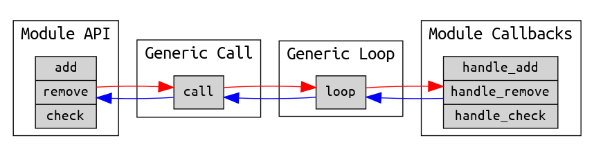
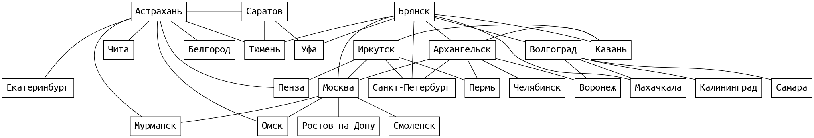

# Модуль GenServer

Давайте еще раз посмотрим на сервер, который мы написали.



У нас есть публичный АПИ модуля, абстрактный (generic) call, абстрактный loop и обработчики запросов.

АПИ и call работают в потоке клиента, loop и обработчики работают в потоке сервера.

АПИ и обработчики реализуют специфичное поведение сервера, а call и loop являются одинаковыми для любых серверов. Поэтому их лучше вынести из модуля в отдельную библиотеку, чтобы переиспользовать в других модулях. 

Стандартный GenServer устроен точно так же:


Те же 4 части (АПИ, call, loop и обработчики) я расположил квадратом.

Два верхних блока (АПИ и call) работают в потоке клиента. Два нижних блока (обработчики и loop) работают в потоке сервера.

Два левых блока (АПИ и обработчики) -- это специфичный код нашего модуля. Два правых блока (call и loop) реализованы внутри фреймворка OTP.


## Сервер PathFinder

### Описание задачи

Возьмем задачу немного сложнее, чем добавление и удаление элементов в списке. Реализуем сервер, который хранит граф с информацией о городах и расстояниях между ними. АПИ сервера позволяет указать два города и получить путь в графе и расстояние между ними. 

Изначально данные хранятся в [csv-файле](./data/cities.csv):

```
Архангельск,Брянск,1598
Архангельск,Воронеж,1723
Архангельск,Казань,2033
Архангельск,Москва,1234
...
```

На старте сервер загружает этот файл и строит по нему граф:


Затем сервер принимает запросы:

```elixir
PathFinder.get_route("Санкт-Петербург", "Самара")
```

и отвечает на них:

```elixir
{["Санкт-Петербург", "Брянск", "Волгоград", "Самара"], 3764}
```

### Работа с графом

Для работы с графом мы возьмем эрланговский модуль [:digraph](https://erlang.org/doc/man/digraph.html). Он входит в стандартную библиотеку, так что нам не придется подключать зависимости. Модуль реализует ориентированный граф (directed graph), а для нашей задачи нужен неориентированный (undirected). Увы, реализации неориентированного графа нет в стандартной библиотеке. 

(В Эликсир есть библиотека [libgraph](https://github.com/bitwalker/libgraph), которая дает более мощное АПИ для работы с графами и более эффективную реализацию).

Работа с :digraph выглядит так:

```elixir-iex
iex(1)> graph = :digraph.new()
iex(2)> :digraph.add_vertex(graph, :a)
iex(3)> :digraph.add_vertex(graph, :b)
iex(4)> :digraph.add_vertex(graph, :c)
iex(5)> :digraph.add_edge(graph, :a, :b)
iex(6)> :digraph.add_edge(graph, :b, :c)
iex(7)> :digraph.get_short_path(graph, :a, :c)
[:a, :b, :c]
iex(8)> :digraph.get_short_path(graph, :c, :a)
false
```

Важный нюанс -- это АПИ сделано не в функциональном стиле. Функции *add_vertex* и *add_adge* не возвращают новый граф, а мутируют существующий. Дело в том, что граф трудно реализовать в иммутабельных структурах данных. Такая реализация хотя и возможна, но не эффективна. В BEAM есть возможность работать с мутабельными данными -- это ETS-таблицы, которые мы будем изучать позже в нашем курсе.

Второй важный нюанс -- для каждой пары городов мы будем добавлять два ребра в обоих направлениях, и таким образом реализуем неориентированный граф поверх ориентированного. Что тоже не очень эффективно, но для учебной задачи подойдет.


### Инициализация сервера

TODO: сперва однопоточное решение по созданию стейта, затем GenServer

Для запуска сервера мы вызваем:

```elixir
GenServer.start(ModuleName, initial_arguments, server_options)
```

В нашем случае это:

```elixir
GenServer.start(PathFinder, :no_args, [name: PathFinder])
```

GenServer.start принимает имя модуля, в котором должно быть реализовано специфичное для сервера поведение -- публичное АПИ, инициализация состояния и обработчики запросов.

Вторым аргументом он принимает некие данные, которые понадобятся серверу при инициализации. В нашем случае никакие данные не нужны, так что я передаю атом `:no_args`. (В этой ситуации часто передают пустой список).

Третий аргумент -- стандартные настройки, определяющие поведение сервера. Мы передаем настройку `name`, благодаря чему сервер регистрируется по указанному имени. И с ним можно взаимодействовать по имени, а не по pid.

GenServer -- это модуль стандартной библиотеки, который реализует ту самую generic часть (call и loop), которую мы видели в своей кастомной реализации. На самом деле он реализует намного больше, чем просто call и loop. 

(Эликсировский модуль GenServer является оберткой над эрланговским модулем :gen_server. В сравнении с эрлангом он добавляет некоторые удобства. Например, автоматически генерирует код всех обработчиков. В эрланге этот код нужно писать вручную.)

При вызове `GenServer.start` запускается новый процесс, и в нем выполянется функция `PathFinder.init`. Это один из 6-ти обработчиков, которые нужно определять в своем модуле. 

```elixir-iex
iex(1)> b GenServer
@callback code_change(...
```

Функция init принимает initial_arguments и формирует состояние процесса. Внутри init мы читаем файл, парсим данные из него и создаем граф.

Вызов GenServer.call блокируется, пока не завершится init. После этого процесс входит в loop с нужны состоянием и готов обрабатывать запросы.


### Обработка запроса

Чтобы отправить запрос серверу мы вызываем:

```elixir
GenServer.call(server_name_or_pid, request)
```

В нашем случае это:

```elixir
GenServer.call(PathFinder, {:get_route, from_city, to_city})
```

Запрос проходит через call и loop и попадает в обработчик:

```elixir
def handle_call({:get_route, from_city, to_city}, _from, state) do
```

То есть обработчик получает запрос и состояние сервера (еще он получает аргумент `from` -- это информация об отправителе, но мы сейчас не будем это рассматривать).

Обработчик должен вернуть ответ на запрос и новое состояние сервера:

```elixir
{:reply, reply, state}
```

В нашем случае состояние не меняется. Но в принципе можно было бы предусмотреть АПИ для модификации графа.

Поиск пути в графе делает библиотека. А вычислить суммарное расстояние нужно нам самим. 

Расстояния между городами можно было бы хранить как аттрибут ребра графа. К сожалению, библиотека не предоставляет удобного способа извлечь этот аттрибут. Поэтому мы будем хранить расстояния отдельно, в словаре:

```elixir
%{
   {city1, city2} => distance
}
```

А сам словарь будем хранить, конечно, в состоянии сервера, вместе с графом.


### Демонстрация работы

```elixir-iex
iex(1)> c "lib/path_finder.exs"
[PathFinder]
iex(6)> PathFinder.start()
{:ok, #PID<0.126.0>}

> PathFinder.get_route("Санкт-Петербург", "Тюмень")
{["Санкт-Петербург", "Брянск", "Тюмень"], 3561}

> PathFinder.get_route("Санкт-Петербург", "Самара")
{["Санкт-Петербург", "Брянск", "Волгоград", "Самара"], 3764}

> PathFinder.get_route("Москва", "Воронеж")
{["Москва", "Архангельск", "Воронеж"], 2957}

> PathFinder.get_route("Екатеринбург", "Махачкала")
{["Екатеринбург", "Астрахань", "Тюмень", "Брянск", "Махачкала"], 9408}
```

### PathFinder как GenServer

Посмотрим еще раз на реализацию PathFinder как GenServer:


Два левых квадрата -- это модуль PathFinder. Он реализует публичное АПИ, которое представлено функциями `start` и `get_route`. Эта часть работает в потоке клиента. И модуль также реализует обработчики `init` и `handle_call`, которые работают в потоке сервера.

Два правых квадрата -- это код внутри фреймворка OTP. Мы будем создавать разные сервера, с разным АПИ, разным состоянием, разными обработчиками. Но все они поддерживаются одним и тем же кодом внутри OTP.


## GenServer behaviour

Чтобы OTP мог взаимодействовать с кастомным модулем, должен быть описан способ взаимодействия. Это описание реализовано с помощью **behaviour**. Behaviour очень похож на **интерфейс** в языке Java и некоторых других языках. 

Behaviour указывает, какие функции обратного вызова (callback) должны быть реализованы в модуле, чтобы модуль был совместим с ним. Например, GenServer behaviour указывает, что модуль должен реализовать 8 функций:
- init,
- handle_call,
- handle_cast,
- handle_info,
- и другие.

```elixir-iex
iex(1)> b GenServer
@callback code_change(old_vsn, state :: term(), extra :: term()) ::
            {:ok, new_state :: term()} | {:error, reason :: term()}
          when old_vsn: term() | {:down, term()}

@callback format_status(reason, pdict_and_state :: list()) :: term()
          when reason: :normal | :terminate

@callback handle_call(request :: term(), from(), state :: term()) ::
```

Behaviour описывает, какие аргументы будут получать эти функции, и что они должны возвращать. 

Когда мы добавляем в модуль код `use GenServer` мы вызываем сложный макрос, который вставляет в наш модуль некоторую реализацию по-умолчанию для этих функций. Благодаря этому, нам не обязательно явно реализовывать все 8 функций, а достаточно реализовать только те, которые нам нужны.

Функции, реализующие behaviour, мы помечаем `@impl true`. Это позволяет компилятору проверить, что они все реализованы и имеют правильную сигнатуру.

Мы уже использовали `init` и `handle_call`. Рассмотрим ещё некоторые из функций обратного вызова, которые необходимы для GenServer behaviour.


### handle_cast

Клиенту не всегда нужен ответ сервера. Или клиент не хочет блокироваться и ждать ответа, а готов получить ответ позже. Для такого асинхронного взаимодействия можно использовать вызов:

```elixir
GenServer.cast(server_name_or_pid, request)
```

и обработчик:

```elixir
handle_cast(request, state)
```

Например, для PathFinder можно добавить АПИ, позволяющее перечитать данные из файла и перестроить граф:

```elixir
def reload_data() do
  GenServer.cast(@server_name, :reload_data)
end

@impl true
def handle_cast(:reload_data, state) do
  %{graph: graph} = state
  :digraph.delete(graph)
  graph = :digraph.new([:cyclic])
  data = load_data()
  Enum.reduce(data, graph, &add_item/2)
  distancies = make_distancies_map(data)
  state = %{graph: graph, distancies: distancies}
  {:noreply, state}
end
```


### handle_info

OTP скрывает отправку сообщений внутри call и cast. Но никто не запрещает отправить сообщение напрямую по имени или pid процесса. В этом случае сообщение попадёт в обработчик handle_info.

Если мы не определили свой обработчик, то действует реализация по умолчанию, которая подставляется макросом:

```elixir-iex
iex(4)> send(PathFinder, :hello)
:hello
iex(5)> 
18:21:01.198 [error] PathFinder PathFinder received unexpected message in handle_info/2: :hello
```

Но если мы добавим свою реализацию, то будет работать она:

```elixir-iex
def handle_info(msg, state) do
  IO.puts("got message #{inspect msg}")
  {:noreply, state}
end

iex(9)> r PathFinder
iex(10)> send(PathFinder, :hello)
got message :hello
:hello
```

Такой способ не принято использовать для реализации АПИ, но можно использовать для внутренних задач. 

Например, сервер может установить мониторинг на какой-то другой процесс и через handle_info обрабатывать сообщения `:DOWN`. 

Или сервер может с помощью таймера отправить отложенное сообщение самому себе и выполнить отложенную работу. На этом строятся задачи типа "очистить кэш если к нему не было обращений в течение 5 минут", или "каждые 30 минут делать http-запрос куда-то".


### Catch All

Обработчики `handle_call`, `handle_cast` и `handle_info` определяют отдельное тело функции (clause) для каждого сообщения, которое они обрабатывают. 

При этом, если отправить сообщение, для которого не предусмотрена обработка, то это вызовет аварийное завершение процесса:

```elixir-iex
iex(14)> GenServer.call(PathFinder, :hello)

18:28:22.783 [error] GenServer PathFinder terminating
** (FunctionClauseError) no function clause matching in PathFinder.handle_call/3
    lib/path_finder.exs:43: PathFinder.handle_call(:hello, {#PID<0.107.0>, #Reference<0.406531561.3370123269.6706>}, %{distancies:
    ...
```

Хорошей практикой является добавление "Catch All" тела (clause), которое перехватывает любые сообщение. 

```elixir-iex
def handle_call(unknown_msg, _from, state) do
  IO.puts("got unknown msg in handle_call: #{inspect unknown_msg}")
  {:reply, {:error, :invalid_call}, state}
end

iex(23)> GenServer.call(PathFinder, :hello)
got unknown msg in handle_call: :hello
{:error, :invalid_call}
```

Здесь мы логируем информацию о полученом сообщении и продолжаем работу. Мы уже видели на примере `handle_info`, что реализация по умолчанию так и работает. Но если мы добавили свою реализацию, то и "Catch All" нужно тоже добавить самим.

В большой системе часто бывает сложно найти, откуда же приходят невалидные сообщения. С `handle_call` и `handle_cast` такое обычно не случается, так как их вызовы обернуты в АПИ модуля. А с `handle_info` это случается. И тогда приходится искать источник.


### terminate

Рассмотрим еще обработчик `terminate`. Как не трудно догадаться, он срабатывает при завершении процесса и выполняет работу противоположную `init` -- освобождает какие-то ресурсы, если это необходимо.

Нюанс в том, что этот обработчик используется очень редко. И он даже не вызывается, если не предпринять дополнительных усилий. Чтобы terminate срабатывал, серверный процесс должен установить флаг `:trap_exit` (то есть, стать системным процессом). 

```elixir
Process.flag(:trap_exit, true)
```

Большинство серверных процессов не имеют ресурсов, которые нужно специально освобождать. Кроме своей собственной памяти процесс еще может владеть:
- TCP или UDP соединением;
- ETS таблицей;
- Файловым дескриптором.

Все эти ресурсы освобождаются автоматически при завершении процесса, и штатном, и аварийном.

terminate можно использовать для каких-то специфических задач. Например, для сохранения состояния процесса в персистентном хранилище.
