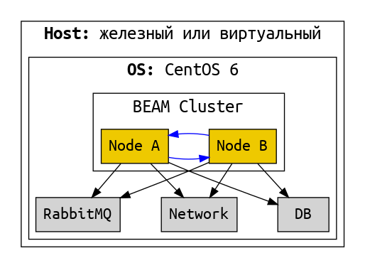
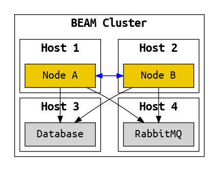
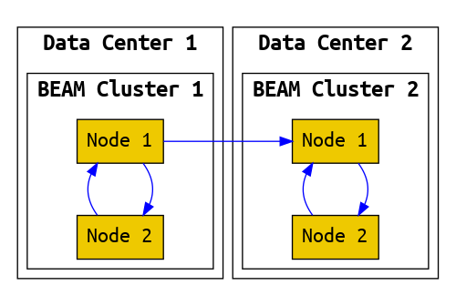

# Релиз

Релиз -- это проект, собранный в пакет и готовый для доставки. И это также процесс сборки проекта в пакет.

В состав релиза входит:
- скомпилированный код (байткод) наших приложений;
- байткод всех необходимых зависимостей;
- конфигурация;
- скрипты для управления системой (для запуска, остановки и тд).

Опционально в состав релиза можно включить виртуальную машину. Если мы не включаем виртуальную машину, то она должна быть установлена на тех хостах, куда мы будем доставлять проект. Причем, что важно, в нужной версии.

Бывает проще включить виртуальную машину в состав релиза, и тогда не требуется её наличия на хостах.

В обоих случаях доставленая и развёрнутая на хосте система выглядит так:


Это минимальная система, состоящая из одного узла.

Не редко система представляет собой кластер из нескольких узлов. Причём этот кластер не самодостаточный, а ему необходимо наличие базы данных, очереди сообщений и взаимодействие с другими системами по сети:



В этом варианте все компоненты развернуты на одном хосте. Такое бывает на стейджинг окружениях и на машине разработчика. Но реально использующаяся система (production) разворачивается на нескольких хостах:



Если пойти еще дальше, то можно построить федерацию -- систему из нескольких кластеров, находящихся в разных датацентрах:




## Инструменты сборки

is a standalone, compiled, runnable system
that consist of the minimum set of OTP applications needed by the system.


Distillery — The Elixir Release Manager
TODO: read hexdocs.pm/distillery

Distillery is a layer of abstraction on top of this complexity.
Normally it manages to hide it, but sometimes the lower levels leak out
and you get to see how the sausage is made.

Тулы для сборки релизов:
- systool (модуль в SASL app)
- reltool
- relx

Низкоуровневые тулы позволяют создавать разные виды релизов. Но этим редко кто-то пользуется.
В Эрланг и в Эликсир есть высокоуровневые тулы: relx и distillery. Их результат немного разный.
Но поскольку это курс по Эликсир, мы сосредоточимся на distillery.


```
defp deps do
  [
    {:distillery, "~> 1.5", runtime: false},
  ]
end

$ mix release.init # generates rel/config.exs
$ mix release --env=prod
...
==> Release successfully built!
You can run it in one of the following ways:
Interactive: _build/dev/rel/sequence/bin/sequence console
Foreground: _build/dev/rel/sequence/bin/sequence foreground
Daemon: _build/dev/rel/sequence/bin/sequence start
```

rel/sequence/releases/0.0.1/sequence.tar.gz
This is the file we deploy to our servers.


## из чего состоит релиз

Релиз состоит из:
- applications
  - user defined
  - 3rd party libs
  - OTP
- configuration files, boot files, start scripts
- erlang run time system

Release doesn't contain source code, documentation files, test etc.

You can build the system on your development machine or the build server and ship only binary artifacts.
The host machine doesn't need to have any tools installed.

You can embed the minimum erlang runtime into release. Then you don't need Elixir and Erlang installed on host machine. Whatever is required to run the system will be part of your release package.

**Release handling** is the way of systematic online system upgrades (and downgrades).

- compiled OTP applications;
- erlang runtime binaries;
- boot script describing which OTP applications need to be started;
- vm.args -- arguments that will be passed to the virtual machine;
- sys.config -- configuration file;
- helper script to start, stop, and interact with the system.

_build/prod/rel/proj_name/releases/0.1.0/proj_name.tar.gz
compressed version of the entire release
copy this file to host machine, unpack, and use bin/proj_name start

This file plays important role in live upgrade.
bin/proj_name upgrade "0.2.0"

Boot file описывает, какие приложения и модули загружать, и запускать, и в какой последовательности.
Создается текстовый, потом компилируется в бинарник.

Sample:
releases/18/start_sasl.script
releases/18/start_sasl.boot

Вообще тут 4 boot файла:
- start_clean.boot -- запустить только kernel и stdlib
- start_sasl.boot -- запустить kernel, stdlib и sasl
- no_dot_erlang.boot -- не выполнять инструкции в файле .erlang при запуске ноды
- start.boot -- копия одного из 3х выше, выполняется по умолчанию.

The main tool to interact with release is the shell script
_build/prod/rel/proj_name/bin/proj_name

- start the system with iex shell in foreground
- start the system as a background process
- attach a remote shell to running system
- stop the system


## Configuration

_build/prod/rel/proj_name/releases/0.1.0/
where 0.1.0 is a version of your application as provided in mix.exs

vm.args
can be used to provide flags to the Erlang runtime
+P sets the maximum number of running processes
Some basic defaults are generated by distillery (node name, cookie)
hexdocs.pm/distillery/configuration.html

sys.config
contains OTP environment variables as specified in mix.exs and config.exs

окружения dev, test, prod, настройки для них.
sys.config -- настройки на уровне релиза, одинаковые для всех машин
двойной запуск для генерации sys.config
настройки для конкретной машины -- через переменные окружения.

*** Emulator flags
vm.args

Deal with memory management, multicore architectures, ports and sockets, low-level tracing, or other internal optimizations.

also:

+Bc -- disables the shell break handler, so when you press the sequence Ctrl-c a,
instead of terminating the virtual machine you terminate just the shell process and restart it

+e Num -- sets the maximum number of ETS tables, which defaults to 2,053

+P Num -- system limit on the maximum number of processes allowed to exist simultaneously.
default is 262,144, range from 1,024 to 134,217,727.

+Q Num -- maximum number of ports allowed in the system,
default to 65,536. range is 1,024 to 134,217,727.

+t Num -- maximum number of allowed atoms, set by default to 1,048,576.


## Доставка (Deployment)

A **deployment** is a way of getting a release into an environment where it can be used.


## Live upgrade

как это работает

почему оно было нужно в телекоме, и почему оно не нужно сейчас

_build/prod/rel/proj_name/releases/0.1.0/proj_name.tar.gz
This file plays important role in live upgrade.
bin/proj_name upgrade "0.2.0"

- migrate state of stateful processes (gen_server.code_change);
- migrate state of ETS tables;
- reconfigure supervision tree;
- restart OTP apps.

Alternative approach: restart nodes in cluster one by one.


A **hot upgrade** is a kind of deployment that allows the release of a currently running application
to be changed while that application continues to run —
the upgrade happens in place with no user-detectable disruption.
