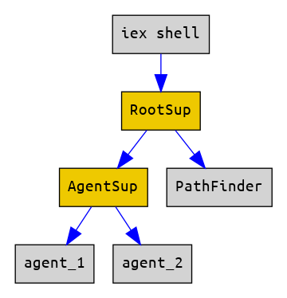

# Использование супервизора

## Запускаем Agent под супервизором

Возьмем ShardManager из прошлого урока. Его нужно будет немного доработать. 

Во-первых, функцию для запуска процесса общепринято называть `start_link`, и она должна принимать один аргумент. Можно назвать функцию иначе, и аргументов сделать больше, но тогда в супервизоре придется переопределять настройки по-умолчанию, что не всегда удобно.

Во-вторых, мы передадим в эту функцию имя агента и его начальное состояние. Так мы сможем запустить несколько агентов с разными именами и состояниями. А поскольку наша функция принимает один аргумент, то придется передать кортеж:

```
def start_link({agent_name, state}) do
  Agent.start(fn () -> state end, [name: agent_name])
end
```

Функцию `find_node` тоже доработаем, чтобы можно было указать имя агента:

```
def find_node(agent_name, shard_num) do
  Agent.get(agent_name, fn(state) -> do_find_node(state, shard_num) end)
end
```

Запустим одного агента, и будем использовать child specification по-умолчанию:

```
def start() do
  state = [
    { 0, 11, "Node-1"},
    {12, 23, "Node-2"},
    {24, 35, "Node-3"},
    {36, 47, "Node-4"}
  ]
  child_spec = [
    {ShardManager, {:agent_1, state}}
  ]
  Supervisor.start_link(child_spec, strategy: :one_for_all)
end
```

Здесь child specification выглядит предельно просто:

```
{ShardManager, {:agent_1, state}}
```

Это модуль агента, и аргументы для start_link. Этого достаточно, потому что в модуле агента мы применяем магию:

```
use Agent
```

Это специальный макрос, который неявно добавляет в модуль функцию `child_spec/1`. Супервизор вызывает эту функцию и получает child specification непосредственно от модуля, который он собирается запускать.

```
> c "lib/agent_with_sup.exs"

> Lesson_12.ShardManager.child_spec(:no_args)
%{
  id: Lesson_12.ShardManager,
  start: {Lesson_12.ShardManager, :start_link, [:no_args]}
}
```

В Эликсире (в отличие от Эрланга) принято соглашение, что каждый модуль сам определяет child specification, необходимый для его запуска. Для Task, Agent и GenServer это генерируется неявно со значениями по умолчанию.

Если мы захотим что-то переопределить, что достаточно передать нужные ключи в макрос:

```
use Agent, restart: :permanent
```

и макрос сгенерирует нужную реализацию:

```
> Lesson_12.ShardManager.child_spec(:no_args)
%{
  id: Lesson_12.ShardManager,
  restart: :permanent,
  start: {Lesson_12.ShardManager, :start_link, [:no_args]}
}
```

Запускаем и смотрим, как это работает:

```
iex(9)> Lesson_12.start()
{:ok, #PID<0.167.0>}

iex(10)> Lesson_12.ShardManager.find_node(:agent_1, 0)
{:ok, "Node-1"}
iex(12)> Lesson_12.ShardManager.find_node(:agent_1, 10)
{:ok, "Node-1"}
iex(13)> Lesson_12.ShardManager.find_node(:agent_1, 15) 
{:ok, "Node-2"}
iex(14)> Lesson_12.ShardManager.find_node(:agent_1, 40)
{:ok, "Node-4"}
iex(15)> Lesson_12.ShardManager.find_node(:agent_1, 60)
{:error, :not_found}
```

## Запускаем двух агентов

Если мы хотим запустить двух агентов, то понадобятся разные `id` в child specification. Реализация по-умолчанию подставляет в качестве id имя модуля (что является общепринятой практикой). 

Но мы не можем запустить двух агентов с одинаковым id, поэтому придется явно указать child specification:

```
def start_2_agents() do
  state_1 = [
      {0, 4, "Node-1"},
      {5, 9, "Node-2"}
  ]
  state_2 = [
      { 0,  9, "Node-1"},
      {10, 19, "Node-2"},
      {20, 29, "Node-3"}
  ]

  child_spec = [
    %{
      id: :agent_a,
      start: {ShardManager, :start_link, [{:agent_a, state_1}]}
    },
    %{
      id: :agent_b,
      start: {ShardManager, :start_link, [{:agent_b, state_2}]}
    }
  ]
  Supervisor.start_link(child_spec, strategy: :one_for_all)
end

```

Смотрим, как это работает:

```
iex(6)> Lesson_12.start_2_agents()
{:ok, #PID<0.125.0>}
iex(7)> Lesson_12.ShardManager.find_node(:agent_a, 5)
{:ok, "Node-2"}
iex(8)> Lesson_12.ShardManager.find_node(:agent_b, 5)
{:ok, "Node-1"}
iex(9)> Lesson_12.ShardManager.find_node(:agent_a, 10)
{:error, :not_found}
iex(10)> Lesson_12.ShardManager.find_node(:agent_b, 10)
{:ok, "Node-2"}
```

(В Эрланг такого рода макросов нет, и все child specification всегда нужно явно прописывать. Впрочем, многие считают это преимуществом исходя из принципа "явное лучше неявного").


## Запускаем Task под супервизором

Модуль [Task.Supervisor](https://hexdocs.pm/elixir/1.12/Task.Supervisor.html) предоставляет аналогичное АПИ как и модуль [Task](https://hexdocs.pm/elixir/1.12/Task.html)

Так что нам достаточно вместо:

```
Task.async(__MODULE__, :find_elixir_sources, [path])
```

сделать

```
{:ok, sup_pid} = Task.Supervisor.start_link()
Task.Supervisor.async(sup_pid, __MODULE__, :find_elixir_sources, [path])
```

и все работает:

```
iex(1)> c "lib/task_with_sup.exs"
[Lesson_12, Lesson_12.FindSourcesTask]
iex(2)> task = Lesson_12.FindSourcesTask.start("lib")
iex(3)> Lesson_12.FindSourcesTask.get_result(task)
["lib/task_with_sup.exs", "lib/agent_with_sup.exs"]
iex(4)> task = Lesson_12.FindSourcesTask.start("../lesson_11/lib")
iex(5)> Lesson_12.FindSourcesTask.get_result(task)
["../lesson_11/lib/path_finder2.exs", "../lesson_11/lib/path_finder.exs"]
```

Task можно запустить под обычным супервизором так же, как мы выше запускали Agent:

```
child_spec = [
  {MyTaskModule, args}
]
Supervisor.start_link(child_spec, strategy: :one_for_all)
```

Но в этом случае нет способа получить результат работы Task. Это подходит для каких нибудь фоновых задач, как, например, прогрев кэшей.


## Запускаем GenServer под супервизором

Запустим PathFinder из прошлого урока. Поскольку там есть `use GenServer`, то и функция `child_spec/1` тоже есть:

```
iex(1)> c "lib/gen_server_with_sup.exs"
[Lesson_12, Lesson_12.PathFinder]
iex(2)> Lesson_12.PathFinder.child_spec(:no_args)
%{
  id: Lesson_12.PathFinder,
  start: {Lesson_12.PathFinder, :start_link, [:no_args]}
}
```

Запуск сервера нужно немного поправить, вместо:

```
def start() do
  GenServer.start(__MODULE__, :no_args, [name: @server_name])
end
```

сделаем:

```
def start_link(_) do
  GenServer.start_link(__MODULE__, :no_args, [name: @server_name])
end

```
чтобы соответствовать child spec, чтобы дочерний процесс линковался с супервизором.

Поправим путь к данным: 

```
@cities_file "../lesson_11/data/cities.csv"
```

Добавим запуск через супервизор:

```
def start() do
  children = [
    {__MODULE__, [:no_args]}
  ]
  Supervisor.start_link(children, strategy: :one_for_all)
end

```
Запускаем и проверяем:
```

iex(6)> Lesson_12.PathFinder.start()
{:ok, #PID<0.163.0>}
iex(7)> Lesson_12.PathFinder.get_route("Москва", "Владивосток")
{:error, :no_route}
iex(9)> Lesson_12.PathFinder.get_route("Москва", "Астрахань")
{:ok, ["Москва", "Мурманск", "Астрахань"], 5469}
```

## Супервизор как отдельный модуль

Нам еще нужно научиться запускать супервизор под супервизором. Для этого дочерний супервизор должен быть представлен модулем. 

Как и для GenServer, существует Supervisor behaviour, который нужно реализовать в этом модуле. behaviour требует наличия только одной функции -- `init/1`.

Запуск Supervisor похож на запуск GenServer. Вот картинка, аналогичная той, что мы видели в 10-м уроке:


Напомню, что два левых квадрата (верхний и нижний), соответствуют нашему модулю.  Два правых квадрата соответствуют коду OTP. Два верхних квадрата выполняются в процессе родителя, два нижних квадрата выполняются в дочернем процессе.

Начинаем с функции `start_link/0`:

```
def start_link(args) do
  Supervisor.start_link(__MODULE__, args, name: __MODULE__)
end
```

Здесь мы просим Supervisor запустить новый процесс для дочернего супервизора. Новый процесс входит в `loop` и вызывает callback `init/1`.

```
@impl true
def init(_args) do
  children = [
    {Lesson_12.AgentSup, [:no_args]},
    {Lesson_12.PathFinder, [:no_args]}
  ]
  Supervisor.init(children, strategy: :one_for_all) 
end
```

Внутри init декларируются дочерние процессы и вызывается `Supervisor.init`. Это отличается от того, что мы делали раньше -- вызывали Supervisor.start_link.

Мы реализуем модуль AgentSup, который будет супервизором для двух агентов, и модуль RootSup, который будет супервизором для PathFinder и для AgentSup. 

Подключим макрос `use Supervisor`, что даст реализацию `child_spec` по умолчанию.

```
c "lib/agent_with_sup.exs"
c "lib/gen_server_with_sup.exs"
c "lib/sup.exs"

iex(13)> Lesson_12.RootSup.child_spec(:no_args)
%{
  id: Lesson_12.RootSup,
  start: {Lesson_12.RootSup, :start_link, [:no_args]},
  type: :supervisor
}
iex(14)> Lesson_12.AgentSup.child_spec(:no_args)
%{
  id: Lesson_12.AgentSup,
  start: {Lesson_12.AgentSup, :start_link, [:no_args]},
  type: :supervisor
}

Lesson_12.MyApp.start_sup_tree()

Lesson_12.ShardManager.find_node(:agent_a, 5)
Lesson_12.ShardManager.find_node(:agent_b, 5)
Lesson_12.PathFinder.get_route("Москва", "Владивосток")
Lesson_12.PathFinder.get_route("Москва", "Астрахань")
```

Таким образом у нас получилось дерево процессов:

