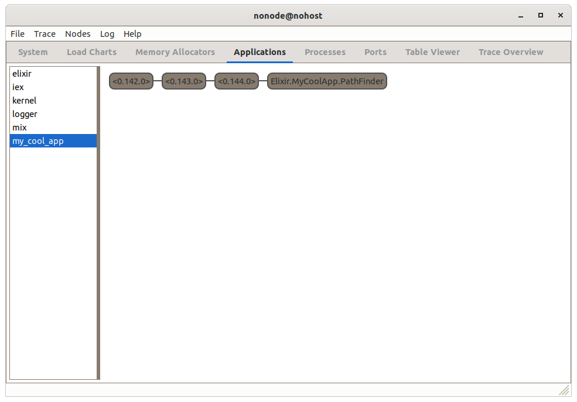
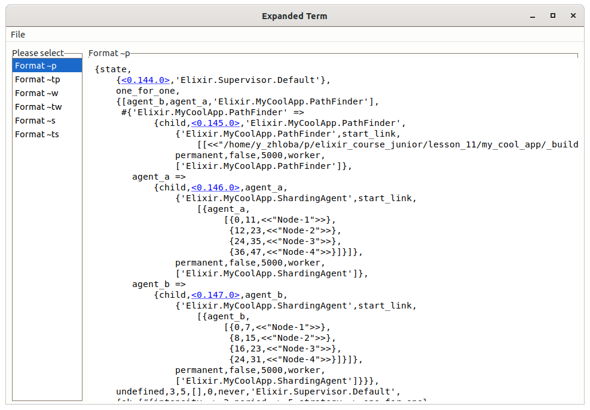
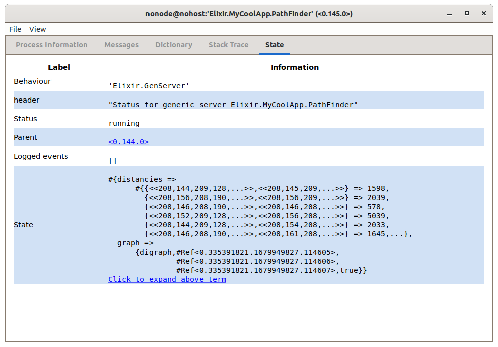

# Observer

В состав Erlang Runtime System входит приложение **Observer**, которое позволяет увидеть все запущенные приложения, дерево супервизоров этих приложений, и информацию по каждому процессу.

Это приложение не консольное, а имеет свой GUI. Для его работы необходимо, чтобы Эрланг был собран с поддержкой библиотеки **wx** (что бывает не всегда). 

Запускается приложение так:

```
> :observer.start()
```

Observer предоставляет много информации о BEAM и работающих приложениях.

В разделе **System** мы общую информацию о виртуальной машине, **Load Charts** показывают в реальном времени нагрузку на CPU, расход памяти и потребление IO. В других разделах можно увидеть, как распределена используемая память, список всех процессов и содержимое ETS-таблиц (о которых мы будем говорить позже).

Сейчас нас интересует раздел **Applications**:



Здесь видны все запущенные приложения, и среди них наше приложение -- **my_cool_app**. Мы видим дерево из 4-х процессов. Три процесса не имеют имен, показаны их pid. Четвёртый процесс зарегистрирован с именем `Elixir.MyCoolApp.PathFinder`. 

Первые два процесса относятся к OTP и реализуют жизненный цикл приложения. Третий процесс -- это корневой супервизор нашего приложения. По двойному клику открывается отдельное окно с подробной информацией об этом процессе:



Тут можно увидеть много полезного, например, содержимое почтового ящика, или текущий state.

Точно также можно посмотреть процесс **PathFinder**:



Можно увидеть, как в state процесса хранится graph и словарь с расстояниями между городами. 

Поскольку Observer, это Эрланг приложение, то и структуры данных там представлены для Эрланг, а не для Эликсир. Это одна из причин, почему Эликсир разработчику полезно хотя бы немного знать Эрланг.

Давайте посмотрим, как работает рестарт процесса:

```
> pid = Process.whereis(MyCoolApp.PathFinder)
> Process.exit(pid, :normal)                 
init PathFinder %{data_file: ["/home/y_zhloba/p/elixir_course_junior/lesson_11/my_cool_app/_build/dev/l
ib/my_cool_app/priv/cities.csv"]} 
true
```

Мы принудительно завершили процесс PathFinder, и видим, что он инициализировался заново. А в Observer можем увидеть, что у него изменился pid.
