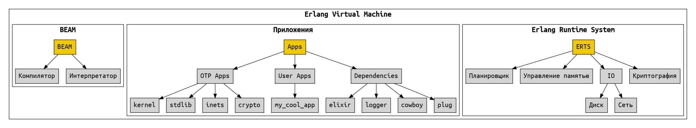
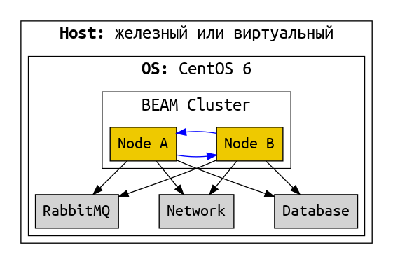

# Релиз

Релиз -- это проект, собранный в пакет и готовый для доставки. И это также процесс сборки проекта в пакет.

TODO проект из одного приложения или из нескольких (umbrella)

В состав релиза входит:
- скомпилированный код (байткод) наших приложений;
- байткод всех необходимых зависимостей;
- скрипты загрузки системы;
- скрипты для управления системой (запуска, остановка, remote console и тд);
- конфигурация;
- ERTS (опционально).

В состав релиза не входит:
- mix;
- исходный код;
- код тестов;
- зависимости, нужные только для тестов;
- любые файлы проекта, для которых явно не указано, что они должны быть в релизе.

Опционально в состав релиза можно включить виртуальную машину. Если мы не включаем виртуальную машину, то она должна быть установлена на тех хостах, куда мы будем доставлять проект. Причем, что важно, в нужной версии.

Бывает проще включить виртуальную машину в состав релиза, и тогда не требуется её наличия на хостах.

В обоих случаях доставленая и развёрнутая на хосте система выглядит так:



Это минимальная система, состоящая из одного узла.

Не редко система представляет собой кластер из нескольких узлов. Причём этот кластер не самодостаточный, а ему необходимо наличие базы данных, очереди сообщений и взаимодействие с другими системами по сети:



В этом варианте все компоненты развернуты на одном хосте. Такое бывает на стейджинг окружениях и на машине разработчика. Но реально использующаяся система (production) разворачивается на нескольких хостах:


Если пойти еще дальше, то можно построить федерацию -- систему из нескольких кластеров, находящихся в разных датацентрах:


## Практика

- Подготовить приложение
  - скопировать PathFinder2 из lesson 11, переименовать exs в ex
  - скопировать cities.csv в priv
  - создать app-модуль и root sup
  - запустить PathFinder из root sup
  - использовать Logger
  - передавать полный путь к cities.csv 
  - скопировать ShardingManager из lesson 11
  - запустить 2 из root sup с разными именами и стейтами
  - вынести конфигурацию в config/config.exs
- собирать релиз
- показать, из чего он состоит
- скрипт запуска, что он умеет
- запустить, пингануть, подключиться remote_console, остановить.
- compile-time and run-time configuration, переменные окружения


### разница между mix run и bin/proj start

Mix itself loads/starts things a little differently than OTP releases

Mix:
- compile sources
- starts BEAM
- loads and starts the :kernel, :stdlib, :compiler, :elixir, and :mix applications
- evaluates the config.exs file 
  in order to ensure the application configuration is set up before your application starts.
- uses the project definition to load and start applications as needed. 

OTP release:
- Mix is not included
- boot script instructs the runtime exactly how to boot everything. 
- custom instruction to ensure that configuration providers, like Mix.Config have a chance to run before your application is started

As a result, there are some small differences in how your application will run under Mix and under a release, but for the most part, there should be no noticeable differences.

Boot script:
- consists of erlang terms
- operates at a very low level, instructing the runtime what modules to load, checkpointing major events, using apply instructions to load and start applications, and more
The script containing instructions for the VM on how to boot. 
The source form has the .script extension, and the “compiled” or binary form of the script has the .boot extension. 

Mix -- специфика Эликсир. Boot script -- часть инфраструктуры Эрланг.


### Что включает в себя релиз

An OTP release at its most basic level describes the applications and their versions, that it needs to run. The file in which this is described is stored with a .rel extension, and looks like so:

```
{release,{"test","0.1.0"},
         {erts,"8.2"},
         [{kernel,"5.1.1"},
          {stdlib,"3.2"},
          {poison,"3.1.0"},
          {logger,"1.4.1"},
          {compiler,"7.0.3"},
          {elixir,"1.4.1"},
          {test,"0.1.0"},
          {iex,"1.4.1"},
          {sasl,"3.0.2"}]}.
```

- release name and version. 
- version of ERTS (the Erlang Runtime System) which the release is targeting. 
- list of the applications and versions of those applications which are required to run the release.

This release descriptor (as I have come to call it), is also what is used to generate the boot script.
convert this high level description into all of the required low-level instructions needed to boot the described release.

Given the release descriptor, and the boot script, a release is packaged by gathering 
- all of the compiled .beam files required by the applications contained in the release, 
- the target ERTS (if included), 
- and any supporting files - such as config.exs, sys.config, vm.args, 
- as well as the shell script used to set up the environment and run the release 
into a gzipped tarball for easy deployment.

Overlay:
When a release is constructed, and prior to it being archived, additional files or directories may be desired in the release, and overlays are used to accomplish that. They consist of a few primitive operations: mkdir, copy, link, and template, and allow you to do one of those four operations to extend the contents of the release as desired.


### Прочее

You can embed the minimum erlang runtime into release. Then you don't need Elixir and Erlang installed on host machine. Whatever is required to run the system will be part of your release package.

**Release handling** is the way of systematic online system upgrades (and downgrades).

- compiled OTP applications;
- erlang runtime binaries;
- boot script describing which OTP applications need to be started;
- vm.args -- arguments that will be passed to the virtual machine;
- sys.config -- configuration file;
- helper script to start, stop, and interact with the system.

_build/prod/rel/proj_name/releases/0.1.0/proj_name.tar.gz
compressed version of the entire release
copy this file to host machine, unpack, and use bin/proj_name start

This file plays important role in live upgrade.
bin/proj_name upgrade "0.2.0"

Boot file описывает, какие приложения и модули загружать, и запускать, и в какой последовательности.
Создается текстовый, потом компилируется в бинарник.

Sample:
releases/18/start_sasl.script
releases/18/start_sasl.boot

Вообще тут 4 boot файла:
- start_clean.boot -- запустить только kernel и stdlib
- start_sasl.boot -- запустить kernel, stdlib и sasl
- no_dot_erlang.boot -- не выполнять инструкции в файле .erlang при запуске ноды
- start.boot -- копия одного из 3х выше, выполняется по умолчанию.

As you can see this script operates at a very low level, instructing the runtime what modules to load, checkpointing major events, using apply instructions to load and start applications, and more 

In an OTP release, this script is actually converted to a binary form, which is stored with a .boot extension, but all this file is, is the result of calling :erlang.term_to_binary/1 on the data structure in the .script file. If you ever need to see exactly what is in the .boot, just run :erlang.binary_to_term/1 on the contents to see the data structure itself.

The main tool to interact with release is the shell script
_build/prod/rel/proj_name/bin/proj_name

- start the system with iex shell in foreground
- start the system as a background process
- attach a remote shell to running system
- stop the system


## Configuration

BEAM на старте читает все настройки из sys.config
В принципе, можно было бы этим и пользоваться. Но sys.config неудобен тем, что в конфигурация в нем описана в erlang term. 
Здесь легко сделать синтаксическую ошибку -- не хватает запятой, или лишняя -- и нода не стартует. А валидации синтаксиса нет.
Даже опытный эрлангист может сделать ошибку. А конфигурацией занимается не только разработчик, но и QA, и DevOps.

А еще для этого файла трудно сделать шаблон, так как синтаксис эрланга будет смешан с синтаксисом шаблона. 

Поэтому обычно идут по другому пути -- генерируют sys.config автоматически из каких-то других конфигов. 
Эликсир тоже идет по этому пути.

dev, test, prod - конфиги. 
releases-конфиг -- это устарело, нужно осваивать ConfigProviders
compile-time and run-time configuration

Config providers are executed prior to boot, and the resulting application env is then persisted to a final sys.config, which is then used by the release itself.

Environment -- A named set of configuration settings which apply to all releases built for that environment. It differs from Mix’s environment, in that it refers to the target environment, not the build environment.

Profile -- A specific combination of release and environment configuration settings.
по идее можно подготовить отдельный профиль для каждого deployment host.

sys.config -- A static file containing Erlang terms, it is one way configuration can be provided to a release.
vm.args -- A file which provides configuration to the Erlang VM when it starts a release.

_build/prod/rel/proj_name/releases/0.1.0/
where 0.1.0 is a version of your application as provided in mix.exs

vm.args
The vm.args file is how one provides configuration for the Erlang VM itself. 
can be used to provide flags to the Erlang runtime
+P sets the maximum number of running processes
Some basic defaults are generated by distillery (node name, cookie)
hexdocs.pm/distillery/configuration.html

sys.config
contains OTP environment variables as specified in mix.exs and config.exs

окружения dev, test, prod, настройки для них.

если мы доставим релиз на несколько хостов, то везде будет идентичная конфигурация
обычно это не то, чего мы хотим
настройки для конкретной машины -- через переменные окружения.

sys.config -- настройки на уровне релиза, одинаковые для всех машин
двойной запуск для генерации sys.config

prod-конфиги запакованы в релиз. Это значит, они идентичные на всех машинах, куда релиз будет доставлен. Как сделать разную конфигурацию для разных машин? Способ "из коробки" -- через переменные окружения. Или можно использовать альтернативные системы конфигурации, которые предлагают сторонние библиотеки.


### Emulator flags
vm.args

Deal with memory management, multicore architectures, ports and sockets, low-level tracing, or other internal optimizations.

also:

+Bc -- disables the shell break handler, so when you press the sequence Ctrl-c a,
instead of terminating the virtual machine you terminate just the shell process and restart it

+e Num -- sets the maximum number of ETS tables, which defaults to 2,053

+P Num -- system limit on the maximum number of processes allowed to exist simultaneously.
default is 262,144, range from 1,024 to 134,217,727.

+Q Num -- maximum number of ports allowed in the system,
default to 65,536. range is 1,024 to 134,217,727.

+t Num -- maximum number of allowed atoms, set by default to 1,048,576.


## Доставка (Deployment)

A **deployment** is a way of getting a release into an environment where it can be used.

Машина, на которой происходит сборка релиза должна соответствовать машине, где система будет запускаться и работать:
- OS, 
- kernel version, 
- architecture, 
- and system libraries. 

Теоретически релиз может быть в некоторой мере кросс-платформенным: BEAM-файлы, конфигурация и bash-скрипты.
Но если в него включена ERTS, то она привязана к конкретной ОС и архитектуре, и зависит от системных библиотек.
(А если ERTS не включена, то подразумевается, что на целевой машине она уже есть, и в нужной версии).
Кроме того, в зависимостях могут быть библиотеки, включающие C-код. 

Можно подготовить соответствующий докер-контейнер, и собирать в нем.
Или можно собирать в CI на какой-то специально подготовленной для этого машине.

https://hexdocs.pm/distillery/guides/deploying_to_aws.html

## Live upgrade

как это работает

почему оно было нужно в телекоме, и почему оно не нужно сейчас

_build/prod/rel/proj_name/releases/0.1.0/proj_name.tar.gz
This file plays important role in live upgrade.
bin/proj_name upgrade "0.2.0"

- migrate state of stateful processes (gen_server.code_change);
- migrate state of ETS tables;
- reconfigure supervision tree;
- restart OTP apps.

Alternative approach: restart nodes in cluster one by one.


A **hot upgrade** is a kind of deployment that allows the release of a currently running application
to be changed while that application continues to run —
the upgrade happens in place with no user-detectable disruption.

Appup - A file containing Erlang terms which describes with **high-level** instructions how to upgrade and downgrade between the current release and one or more older releases.

Relup - A file containing Erlang terms which describes with **low-level** instructions how to upgrade and downgrade between the current release and one or more older releases.
